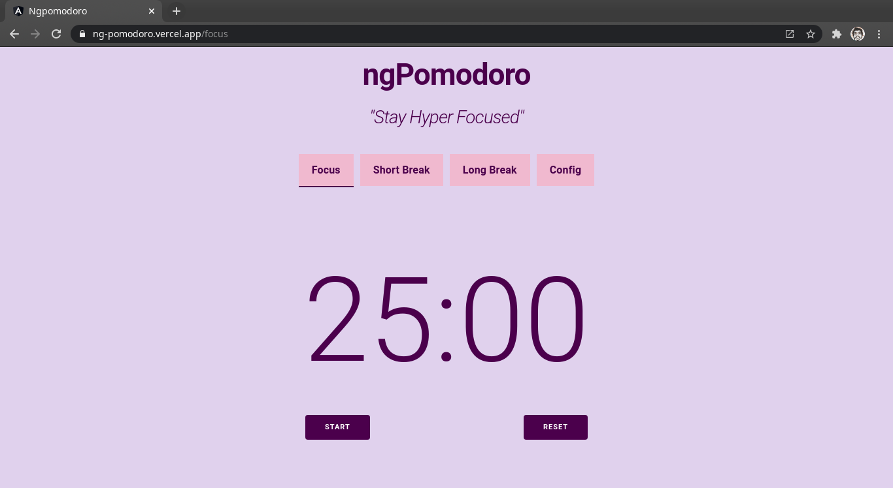

# Ngpomodoro

A simple Pomodoro app built on Angular that helps you stay productive.

## Use the app

Visit : https://ng-pomodoro.vercel.app/

## Try the app localy

Clone the repo `git clone https://github.com/VishnuDileesh/ngPomodoro`

## Development server

Run `ng serve` for a dev server. Navigate to `http://localhost:4200/`. The app will automatically reload if you change any of the source files.

## Build

Run `ng build` to build the project. The build artifacts will be stored in the `dist/` directory. Use the `--prod` flag for a production build.

